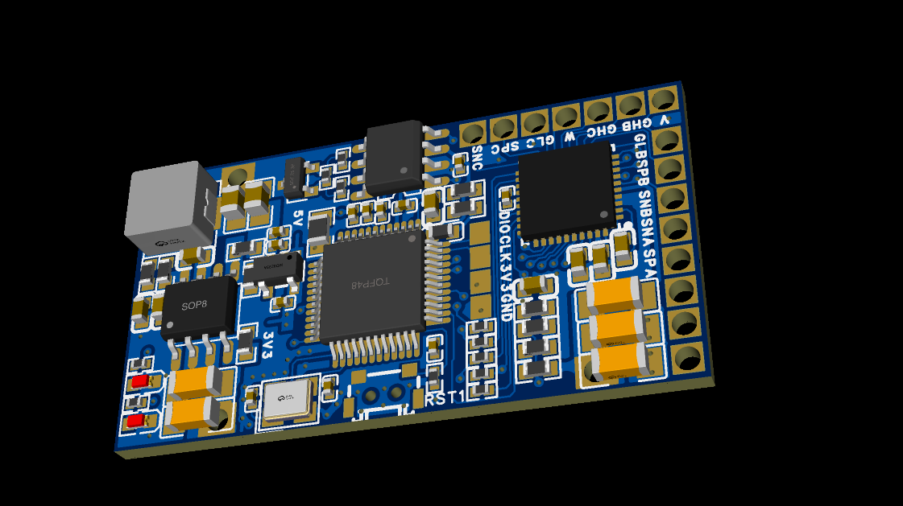
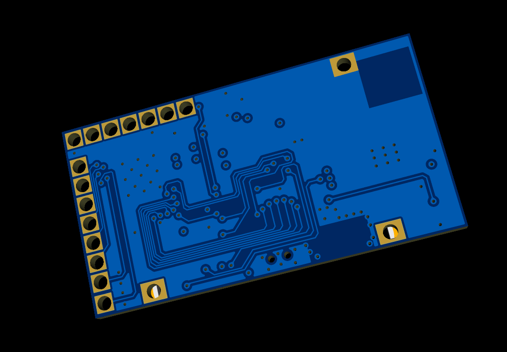
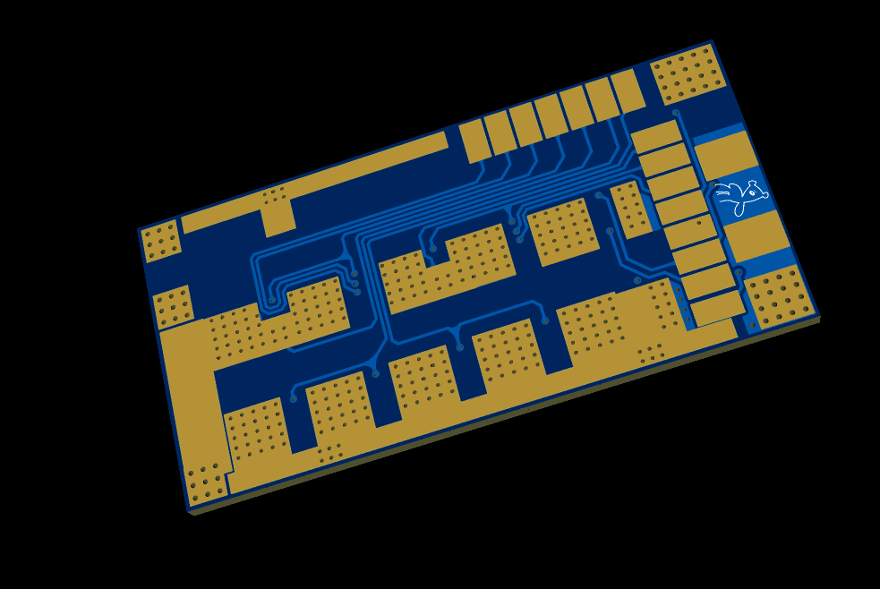
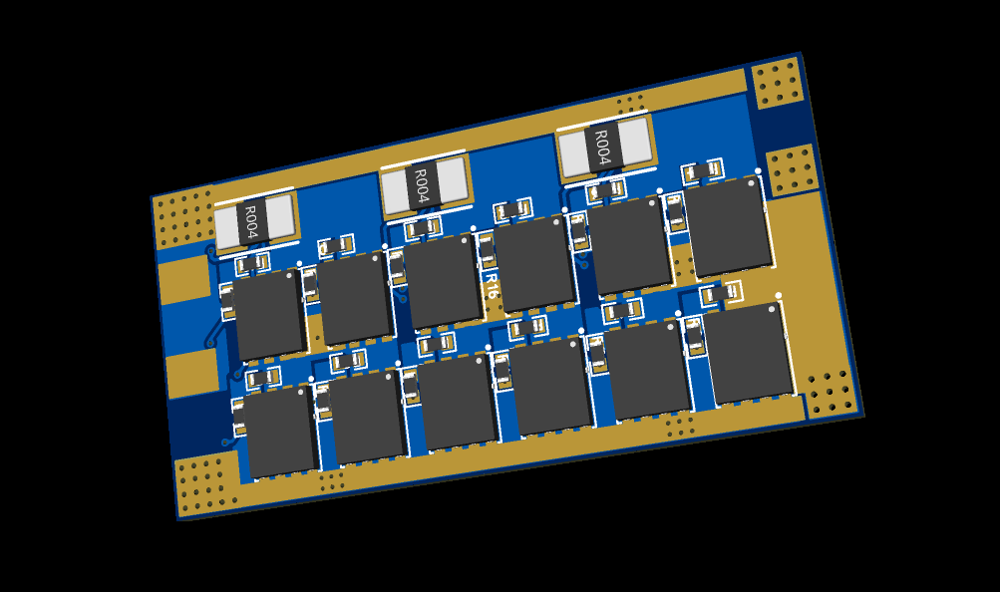

# HighPower-ESC

HighPower-ESC 是一套面向 BLDC/PMSM 电机的高功率密度 FOC 电调项目，包含 LKS32MC071 固件工程和嘉立创 EDA 硬件设计资料。

这个项目的目标是在较小体积内实现较高电流输出，适合无人车、机器人、模型动力、电动工具、小型推进器等需要紧凑型大功率三相驱动的场景。

## 主要规格

| 项目 | 参数 |
| --- | --- |
| 输入电压 | 3S-12S 锂电池输入，约 11.1V-44.4V 标称，满电最高约 50.4V |
| 最大电流 | 最高 60A，实际能力取决于散热、铜厚、连接器和持续工作时间 |
| 控制对象 | BLDC / PMSM 三相无刷电机 |
| 控制方式 | FOC，支持 SVPWM、电流环、速度环、启动对相、VF 启动等控制流程 |
| 主控芯片 | Linko LKS32MC071CBT8 |
| 栅极驱动 | TI DRV8353S 三相智能栅极驱动器 |
| 功率级 | BSC035N10NS5 MOSFET 三相桥，底板布置 12 颗 MOSFET |
| 电流采样 | 分流电阻采样，硬件提供三相采样节点，当前固件按 2-shunt 电流采样配置 |
| 通信接口 | CAN，UART/SWD 调试接口 |
| 硬件版本 | revA / V1.1 |

> 注意：60A 是硬件设计目标和短时能力描述，不代表在所有散热和输入条件下都可以持续输出。首次大功率测试前必须完成低压、限流、空载和温升验证。

## 板卡预览

### 主控板

主控板负责电机控制、三相栅极驱动、采样信号处理、CAN 通信和电源转换。核心器件包括 LKS32MC071CBT8、DRV8353SRTAR、TCAN332DR、LM5164、SPX3819-3.3 等。





### 底板

底板主要承载大电流功率回路，包括输入母线、三相输出、母线电容连接点、MOSFET 三相桥和低阻电流采样电阻。功率级采用 12 颗 BSC035N10NS5 MOSFET 构成三相桥，每相上下桥臂使用并联 MOSFET 提高电流能力并降低导通损耗。





## 硬件说明

### 主控与外设

主控使用 `LKS32MC071CBT8`，固件当前配置主频为 96MHz。该芯片面向电机控制应用，工程中使用到的主要外设包括：

- `MCPWM`：产生三相互补 PWM，用于驱动三相桥。
- `ADC0/ADC1`：采集相电流、母线电压、母线电流、温度和反电势相关信号。
- `CMP`：用于过流等快速保护链路。
- `OPA`：配合电流采样信号进行放大/调理。
- `UART`：调试或参数通信接口。
- `CAN`：电调外部通信接口。
- `HALL/QEP`：预留传感器相关接口能力。
- `NVR/Flash`：用于参数存储和配置。

### 栅极驱动

三相栅极驱动使用 `DRV8353SRTAR`。主控输出六路 PWM 控制信号：

- `INHA / INLA`
- `INHB / INLB`
- `INHC / INLC`

DRV8353S 输出三相上下桥臂栅极驱动信号：

- `GHA / GLA`
- `GHB / GLB`
- `GHC / GLC`

驱动器还提供：

- `nFAULT` 故障输出
- `nSCS / SCLK / SDI / SDO` SPI 配置与诊断接口
- `SOA / SOB / SOC` 三相电流采样放大输出
- `ENABLE` 驱动使能控制

### 采样方式

硬件上提供三相电流采样路径，底板上可以看到三只 `0.5mΩ` 低阻采样电阻，对应 `SPA/SNA`、`SPB/SNB`、`SPC/SNC` 采样节点，送入 DRV8353S 的电流采样放大通道后输出 `SOA/SOB/SOC` 给主控侧 ADC/OPA。

当前固件配置为 `CURRENT_SAMPLE_2SHUNT`，即按双电阻采样方式运行。后续如果要改为三电阻采样，需要同步检查：

- 硬件采样通道连接
- ADC 触发时序
- PWM 中心对齐采样点
- 相电流方向和零点偏置
- `hardware_config.h` 与 `project_config.h` 中的采样宏

除相电流外，硬件还包含：

- `VBUS_ADC`：母线电压采样
- `NTC_ADC`：板载温度采样
- `M0_ADC_BUS_CURR_CH`：母线电流采样通道
- `BEMF_CH_A/B/C`：反电势采样通道预留

### 电源与通信

主控板包含宽输入降压和本地低压电源：

- `LM5164DDAR`：从输入母线降压到 5V
- `SPX3819-3.3`：5V 降压到 3.3V
- 模拟 3.3V 经过磁珠隔离，用于采样和模拟前端

通信部分包含：

- `TCAN332DR` CAN 收发器
- CANH/CANL ESD 防护
- 120Ω 终端电阻位置
- UART/SWD 调试接口

## 固件说明

固件位于：

```text
firmware/lks32mc071-foc/
```

当前工程基于 LKS32MC071 电机控制例程，并加入用户 FOC 移植层。代码主要包含以下部分：

```text
1_LKS_FwLib/                 LKS32MC07x 外设驱动库
2_HardwareDriverLayer/       系统初始化、PWM、ADC、中断、硬件抽象
3_CommonServiceLayer/        公共数学函数、数据交换结构、驱动实例
4_MotorDriveLayer/           FOC 驱动、SVPWM、PID 调节器、电机控制核心
5_MotorAppLayer/             电机应用状态机、启动/停止、功率计算、故障检测
6_UserAppLayer/              用户应用层接口
7_UserFocPort/foc_lib/       用户移植的 FOC 算法库和 HAL 适配层
Include/                     工程配置、电机参数、硬件参数
RTT/                         SEGGER RTT 调试输出
```

### 当前固件能力

固件目前已经可以在 LKS32MC071 工程中编译通过，包含以下能力：

- 基于 `MCPWM` 的三相 PWM 输出框架
- 16kHz PWM 频率配置
- 约 1200ns 死区时间配置
- ADC 电流偏置校准
- 双电阻相电流采样配置
- 母线电压、母线电流、温度采样通道配置
- 7-segment SVPWM
- 电流环 PI
- 速度环 PI
- 传感器less 速度闭环配置
- PLL 观测器相关参数
- VF 启动和对相流程
- 弱磁控制相关参数
- 过流、过压、欠压、过温、堵转、缺相、启动异常等故障检测框架
- RTT 调试输出
- EIDE / Keil 工程配置

用户移植的 `7_UserFocPort/foc_lib` 中包含：

- Clarke / Park 变换
- 反 Park / SVPWM 输出计算
- 电流环、速度环、位置环结构
- PLL、SMO、HFI、弱磁等算法模块
- FOC HAL 适配接口

当前移植阶段仍建议保留安全验证流程。`user_foc_hal.c` 中的 LKS HAL 适配层曾用于安全占位和影子状态记录，接入真实 MCPWM/ADC 前应逐项验证 PWM 波形、电流采样方向、ADC 零点、保护链路和驱动使能顺序。

## 硬件资料

硬件资料位于：

```text
hardware/revA/
```

目录内容：

```text
source/     嘉立创 EDA 工程源文件
 gerber/    Gerber 生产文件
bom/        BOM 物料表
cpl/        贴片坐标文件
preview/    原理图、PCB PDF 和板卡预览图
```

当前包含两块板：

- 主控板 V1.1：主控、驱动、采样、电源、CAN 通信
- 底板 V1.1：MOSFET 三相桥、母线接口、三相输出、大电流采样电阻

## 编译环境

推荐使用以下环境打开固件工程：

- VSCode + EIDE
- Keil MDK / ARMCC 5
- LKS07x 芯片包
- 目标芯片：`LKS32MC071CBT8`

VSCode/EIDE 工程配置文件位于：

```text
firmware/lks32mc071-foc/.eide/eide.yml
firmware/lks32mc071-foc/LKS07x_1Motor.code-workspace
```

如果 EIDE 报找不到 `lks32mc07x.h` 或 `basic.h`，需要确认芯片包头文件路径已经包含：

```text
.pack/Linko/LKS07x.1.2.0/Device/Include
```

## 调试建议

首次上电和带电机测试请按以下顺序进行：

1. 不接电机，只给低压母线供电，确认 5V、3.3V、3.3V_A 正常。
2. 示波器检查六路 PWM，确认频率、互补关系和死区时间正确。
3. 禁止驱动输出时检查 `nFAULT`、`ENABLE`、栅极默认状态。
4. 低压限流条件下接电机，先做开环小占空比测试。
5. 校准 ADC 零点，确认相电流采样方向正确。
6. 再逐步启用闭环电流环、速度环和保护逻辑。
7. 大电流测试必须加散热，监控 MOSFET、采样电阻、驱动芯片和 PCB 铜皮温升。

## 安全提示

这是一个高功率电机控制器项目。错误的 PWM 极性、采样方向、死区时间、驱动使能顺序或电流环参数都可能导致 MOSFET 直通、过流、炸管或电机失控。

请务必在以下条件下进行初次测试：

- 使用限流电源或串联保险保护
- 从低母线电压开始
- 电机空载测试
- 示波器确认 PWM 和相电流波形
- 不要一开始就使用 12S 满电和大电流负载
- 确认急停和断电方式可靠

## 版本说明

当前仓库状态：

- 硬件：revA / V1.1
- 固件：LKS32MC071 FOC 移植与调试阶段
- 目标：3S-12S 输入，最高 60A，高功率密度 BLDC/PMSM FOC 电调
